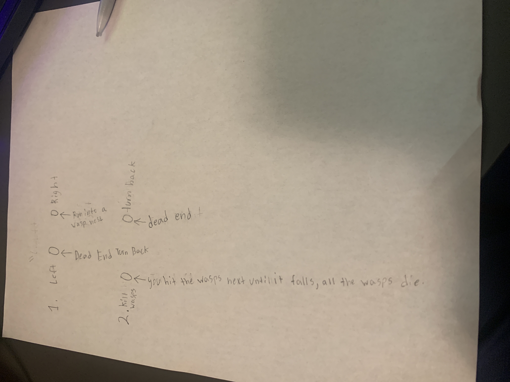

# The Possible

## Descriptions

Basically my game is going to be where the objective is to get out of the maze through different paths. You are going through one big maze and choose which paths you want to follow. Some paths can lead you to death and some can lead you out of the maze. The game is mean't to be easy because by the name, it's got to be possible

## Flow chart
 (I can't make it longer because it won't fit on the paper. I do have more ideas though.)

Sketch a flow chart of your game. What are the options the user can choose between, and where will those choices lead them? You might want to draw this on paper, take a picture, and upload that here.